# CIS 5660 HW04 Procedural Buildings

## Final Render

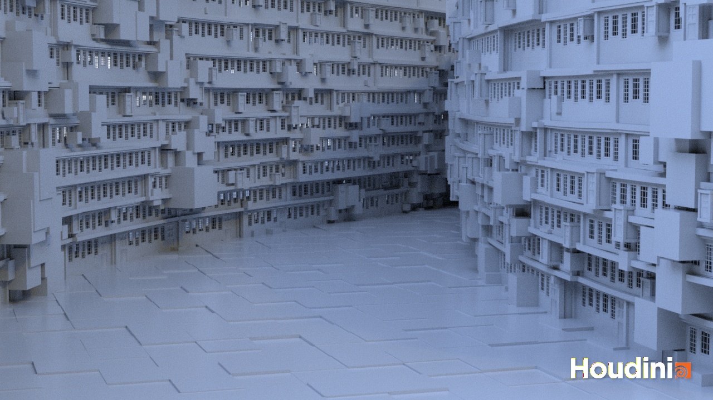

For this project, I created a Procedural City Block tool in Houdini.  Its style is based off of Nier Automata's Copied City area.  I used a lot of the methods described in [this](https://www.youtube.com/watch?v=uIe97023sDk&t=979s&ab_channel=SimonHoudini) tutorial by Simon Houdini.

## Concept Art
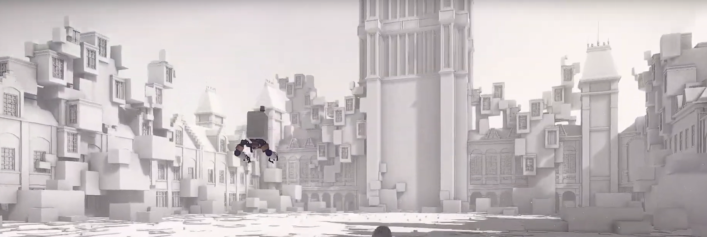
Nier Automata Gameplay Screenshot

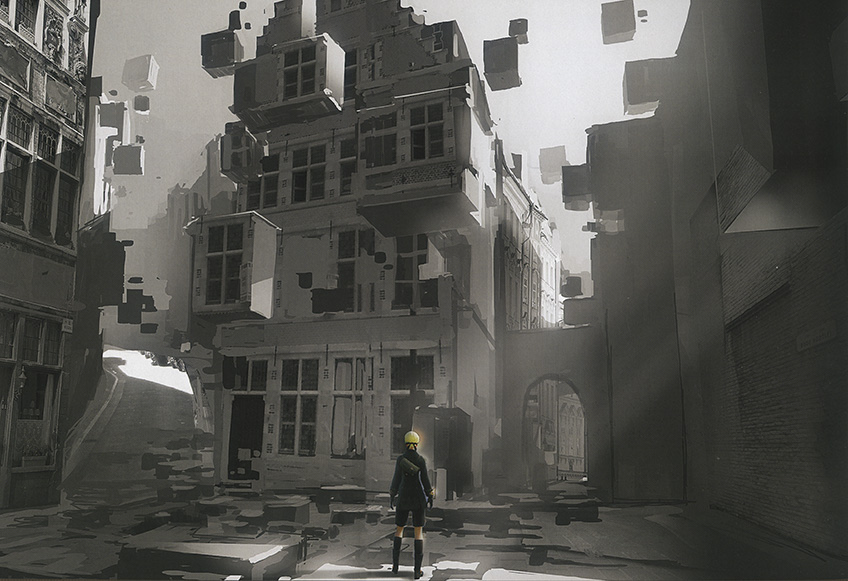
Nier Automata Concept Art

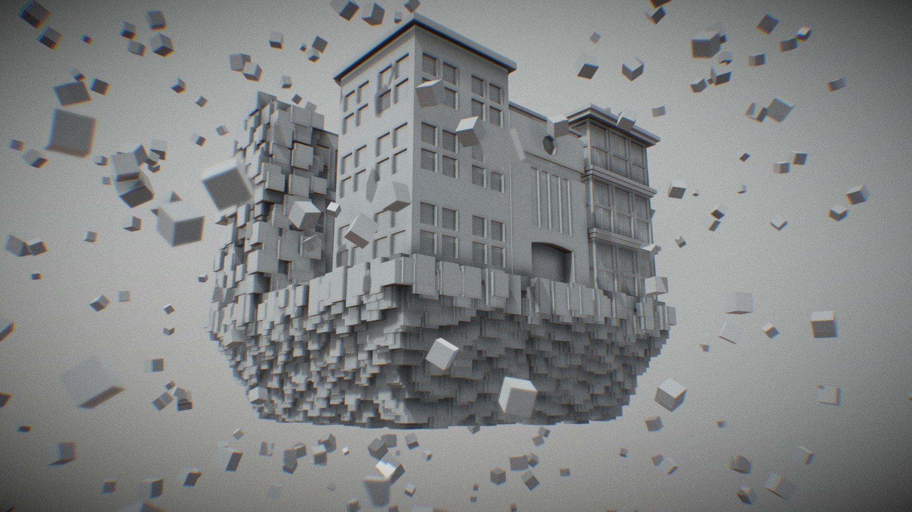
[Model by Avery Kukla](https://sketchfab.com/3d-models/the-copied-city-nier-automata-fan-art-ad0b9ae692534a789ccd9133b20aa6ac)

## Demo Video

[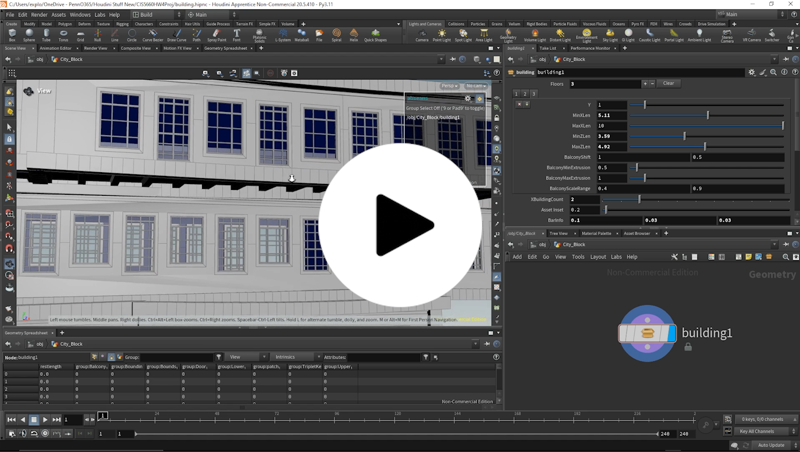](https://youtu.be/oGzwwsLkMv4)

## Box Stacking

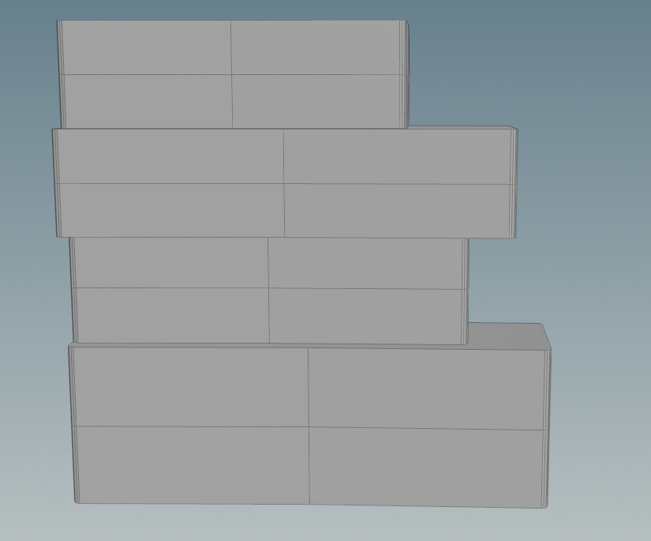

Using a foreach loop with a match size node, I stacked building blocks on top of each other.

## Asset Placement

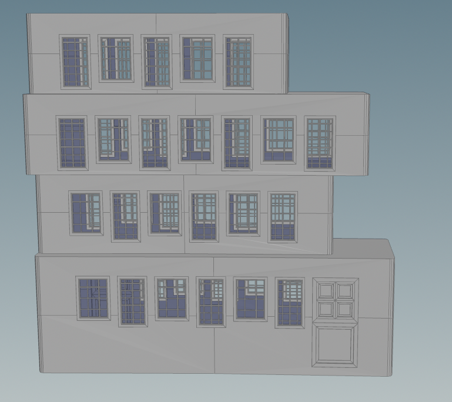

Through extracting the perimeter curve along the bottom of each box, I was able to place assets on the side of the building.  The windows and door assets were created with Houdini.

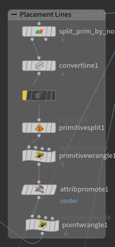

## Borders and Pillars

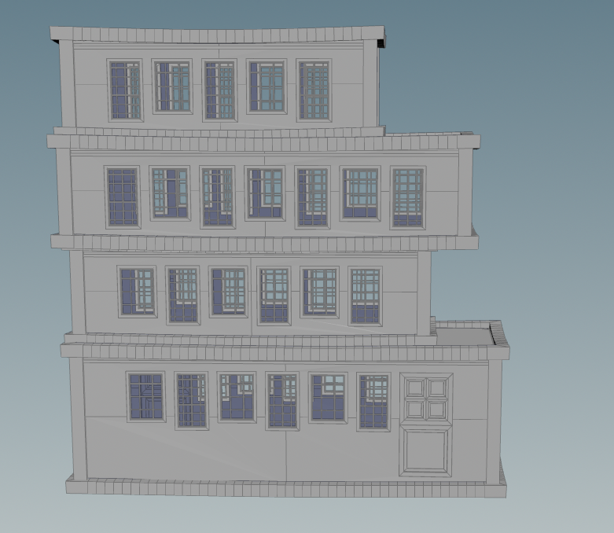

For the borders on the bottom and top of each box, I extracted the perimeter curves of the top and bottom of each box, then translated the middle of each segment a bit down to create a bend, then subdivided it, and then sweeped it with a box curve.

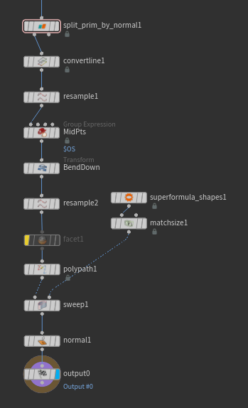

For the pillars, I placed a box on each of the bottom 4 corners of each box.

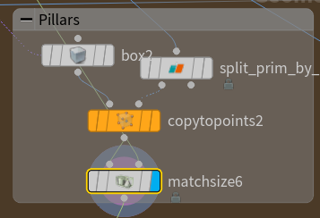

## Supports

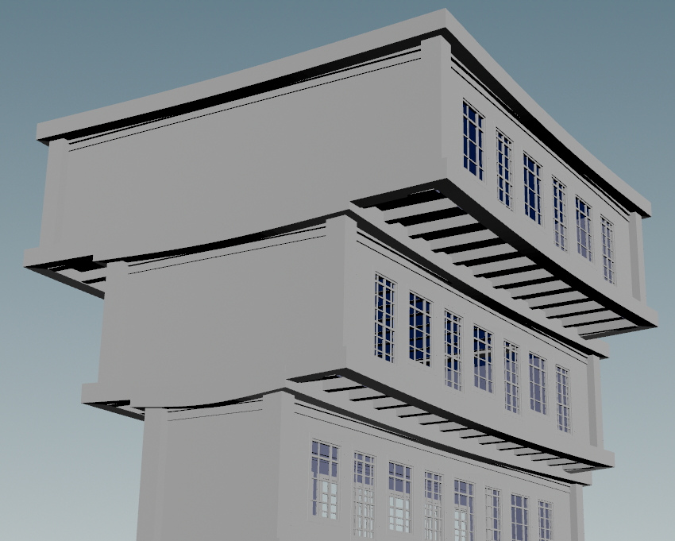

To create the supports, each box subtracts the box below it from itself so that it knows where to place the supports.  More specifically, each box takes the top of the box below it, extrudes it upwards, and then subtracts that from its own bottom face.

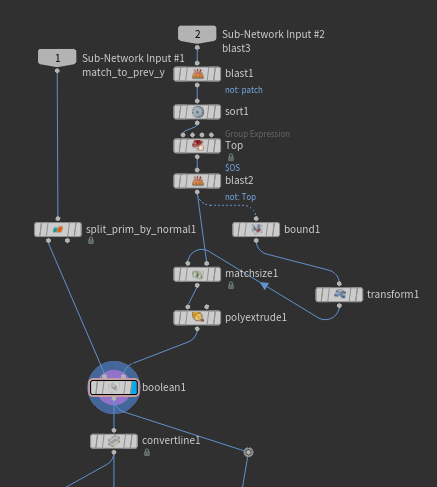

## City Block

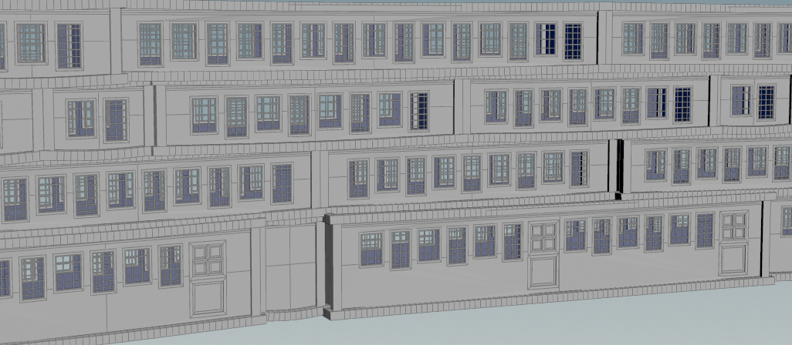

To create a city block, I repeated the city horizontally.  Instead of stacking a single box at a time, I used another foreach loop to first stack boxes horizontally, and then stack entire lines of boxes upwards.

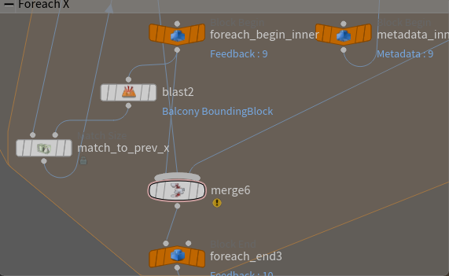

## Balconies

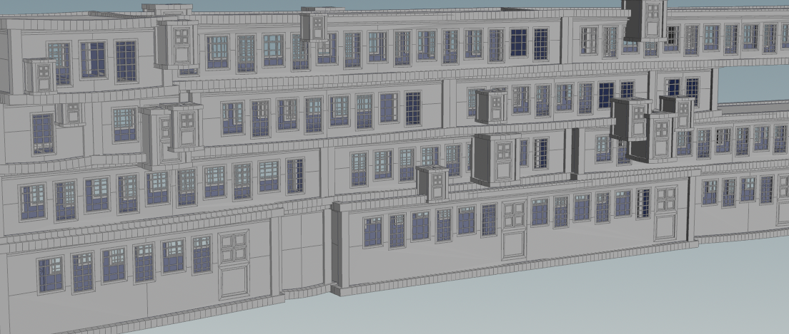

I created a tiny balcony block using the building HDA, and then placed it similar to how the windows and doors were placed on each building block.  After placing the balcony blocks, I shift them randomly so that the city block looks more surreal and like the Nier Automata reference.

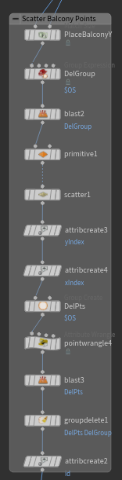

## Blocks

I used a noise texture to create a density attribute, and then I scattered blocks based on that density attribute.  The scale of the blocks also get larger in high density areas.

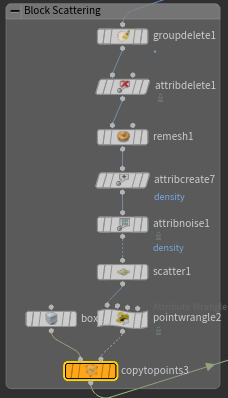
